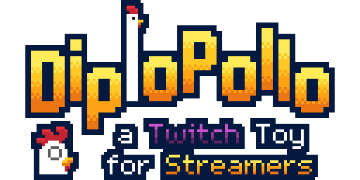
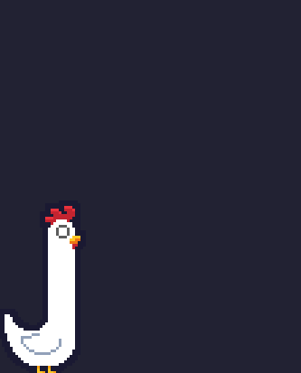

# DiploPollo™ - Interacción de chat de Twitch para OBS

## Descripción

**DiploPollo™** es una aplicación web diseñada para ser utilizada como overlay en OBS Studio, permitiendo a los streamers y sus espectadores interactuar de manera divertida. Los espectadores pueden donar bits o enviar comandos para hacer crecer el cuello de un simpático pollo en la transmisión en vivo.

La página principal de DiploPollo™ ofrece una interfaz intuitiva para personalizar la URL del overlay con diversas configuraciones, skins y características especiales.

> El DiploPollo™ está basado en los pollos de [Gallinerica](https://manzdev.itch.io/gallinerica).

## Características Principales

- Interacción en tiempo real: Los espectadores pueden enviar bits y el `!pollo` en el chat para interactuar con el pollo en la transmisión en vivo.

- Si se elige el modo comando, el comando `!pollo 20` aumentará 20 píxels el cuello del pollo. Se pueden usar otros valores numéricos, tanto positivos como negativos.

- Personalización fácil: La página principal permite a los streamers personalizar la URL del overlay con configuraciones específicas, como skins, comportamientos y más.

- Totalmente compatible con OBS Studio: Integración sencilla para agregar el overlay y mostrar la interacción en pantalla.

## Capturas de Pantalla

*WIP*

### Requisitos Previos

- OBS Studio instalado en tu computadora.
- Cuenta de Twitch para transmitir.
- Conexión a internet.

### Configuración

1. Visita [https://manzdev.github.io/twitch-diplopollo/](https://manzdev.github.io/twitch-diplopollo/) para personalizar tu DiploPollo™ en tu overlay.
2. Sigue las instrucciones en la página para configurar tu overlay con las opciones deseadas.
3. Copia la URL generada.

### Agregar DiploPollo™ a OBS Studio

1. Abre OBS Studio.
2. Crea o selecciona la escena donde deseas agregar el overlay de DiploPollo™.
3. Agrega una "Fuente" de tipo "Navegador" (Browser Source).
4. Configura la fuente con la URL generada de DiploPollo™.
5. Ajusta el tamaño a pantalla completa (recomendado).

## Contribución

Si deseas contribuir a este proyecto, sigue estos pasos:

1. Haz un fork del repositorio en GitHub.
2. Crea una nueva rama para tu contribución: `git checkout -b mi-contribucion`
3. Realiza tus cambios y asegúrate de que todo funcione correctamente.
4. Envía un pull request a la rama `main` del repositorio original.

También puedes darnos nuevas ideas o enviarnos skins para añadir en el [Discord de Manz.dev](https://discord.manz.dev/).

## Ideas y posibles features o cambios

- [ ] Confetti selectivo, sólo en incrementos > 20 (BlurSoul_)
- [X] Cooldown en comandos (Chrisvdev)
- [ ] Cartelito con quien lo ha activado
- [ ] Skin random (BlurSoul_)
- [ ] Frases para el pollo (omaarguirre)
- [ ] Diplopollo ponga huevos
- [ ] DiploPollo 3000
- [ ] Refactorización y reorganización de código

## Créditos

- Desarrollado en directo en el canal [ManzDev](https://manz.dev/).
- Basado en [Javascript](https://lenguajejs.com/), utilizando [WebComponents](https://lenguajejs.com/webcomponents/).

## Licencia

Esta herramienta es open source, con licencia GPL y puedes modificarlo, ampliarlo o utilizarlo para aprender, sólo te pido que enlaces y menciones el original.

---

Esperamos que disfrutes utilizando DiploPollo™ en tus transmisiones. ¡Diviértete interactuando con tus espectadores!
